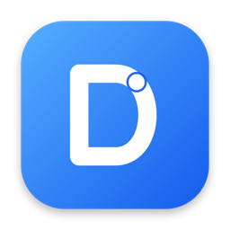
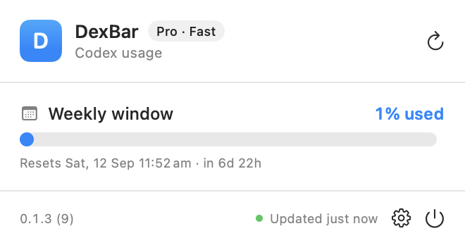
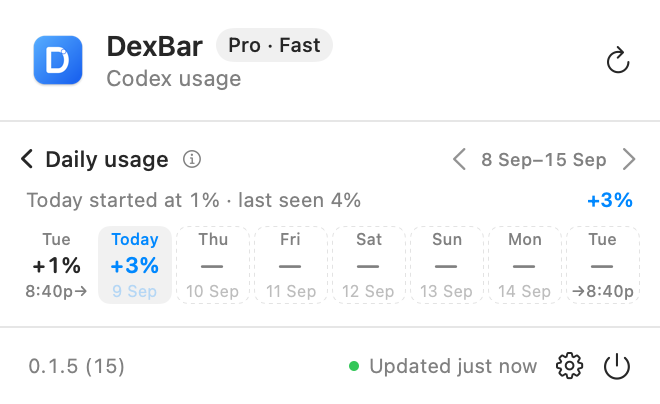
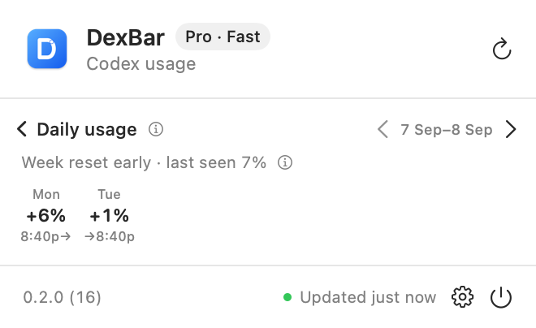
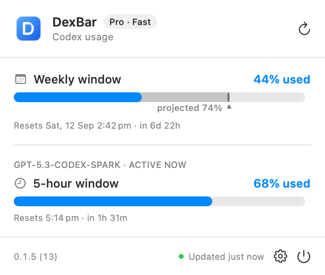
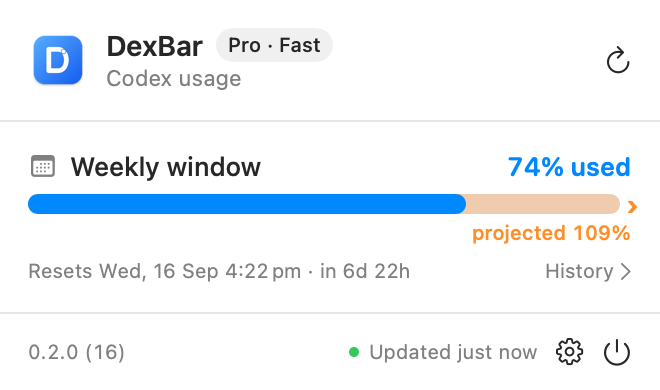

<p align="center">
  
</p>

<h1 align="center">DexBar</h1>

<p align="center">
  A small, native macOS menu-bar app for the Codex usage limits on your ChatGPT account.
</p>

<p align="center">
  
  
  
  <a href="https://github.com/vmlrodrigues/DexBar/releases/latest"></a>
</p>

<p align="center">
  <a href="https://github.com/vmlrodrigues/DexBar/releases/latest/download/DexBar.dmg"></a>
</p>

DexBar uses the ChatGPT account already signed in through the Codex CLI. It is built with
SwiftUI and AppKit, contains no web view, and stays out of the Dock. The normal display is
deliberately quiet: weekly usage remains primary, while shorter or model-specific limits
surface only when Codex reports that they matter.

Version **0.2.2** stores usage history in UTC and recalculates daily totals in your Mac’s
current time zone, preserving history as you travel.
See the [0.2.2 release notes](https://github.com/vmlrodrigues/DexBar/releases/tag/v0.2.2).

<p align="center">
  <a href="Docs/DexBar-current.png"></a>
</p>

<p align="center"><sub>The minimal weekly view, using sample data.</sub></p>

> [!NOTE]
> DexBar is an independent, unofficial tool. It is not made or endorsed by OpenAI. It uses
> a local Codex app-server interface that may change or stop working in a future Codex release.

## What it shows

- Weekly usage, percentage used, time remaining, and the exact reset date.
- Active shorter windows, such as a five-hour model limit, only after they have actually
  been used or reached.
- Model-specific long windows once they reach warning territory, without filling the popover
  with inactive or low-usage meters.
- A local weekly projection after 24 hours of history for the same reset window. When enough
  recent movement exists, DexBar blends the full-window pace with a recency-weighted trend.
- A compact daily history for the current and recent weekly windows, including honest markers
  when this Mac did not observe enough data to attribute usage to an exact day.
- A deliberately quiet short-window projection after one hour, shown only when it points to
  at least 60% usage by reset.
- The ChatGPT plan and default Codex service mode—Standard, Fast, or Ultra Fast—when the local
  app server reports them.
- Usage-credit status when Codex reports credits, a non-zero balance, or unlimited access.
- Connection, stale-data, missing-CLI, and sign-in states while retaining the last successful
  reading whenever possible.
- The exact application version and build number in the popover footer.

The menu bar normally represents the weekly window. If an active supplementary window becomes
more urgent, DexBar automatically surfaces that window instead. Its text can be configured as
percentage and time, time and percentage, percentage only, or time only.

## Daily history

Open **History**—or select the weekly meter—to see how much of the current allowance was used
on each local calendar day. With the popover open, press **Right Arrow** to open daily history
and **Left Arrow** to return to the weekly view. Future days remain visible as quiet placeholders,
while boundary times make partial first and last days explicit. Extended windows open with today visible;
small arrows beside the daily strip provide access to earlier and later days. Readings are
stored as absolute UTC timestamps. All daily totals and date labels are calculated in your
Mac’s current time zone and update when it changes, including during travel. Day lengths
follow the local calendar, including daylight-saving transitions. The time-zone label shows
which zone is being used; changing zones does not discard readings or restart tracking.

Use the arrows beside the date range to move between allowance windows. Background refreshes
keep the selected window in place while it remains in the stored history.

Daily totals use these markers:

| Example | Meaning |
| --- | --- |
| `+5%` | Usage measured from a reset or a baseline close to local midnight. |
| `≈5%` | Estimated daily attribution across a longer observation gap. |
| `≥5%` | At least this much usage since the first observation; the day's baseline is incomplete. |
| `—` | No daily total is available, or the day is still in the future. |

<p align="center">
  <a href="Docs/DexBar-history-current.png"></a>
</p>

<p align="center"><sub>The current usage week, with future days left visible.</sub></p>

If OpenAI starts a new allowance before the advertised reset, DexBar closes the previous window
at the reported boundary when known, or the first observed replacement otherwise, and marks
it as an early reset. The usage response does not say why an individual reset occurred, so
DexBar reports the event without guessing at its cause.

<p align="center">
  <a href="Docs/DexBar-history-reset.png"></a>
</p>

<p align="center"><sub>A shortened week clearly identified as an early reset.</sub></p>

History is calculated from readings stored on this Mac. Usage from another computer, or gaps
while DexBar is not running, may therefore be marked as estimated, partial, or unavailable.
Completed windows show the last observed percentage rather than claiming a final total that
this Mac may not have seen.

## When another limit matters

An active short window appears beneath the weekly allowance, with its model or bucket name for
context. Inactive short windows remain invisible.

<p align="center">
  <a href="Docs/DexBar-active-window.png"></a>
</p>

<p align="center"><sub>An active five-hour window, using sample data.</sub></p>

Projection is shown on the same meter. The marker indicates the central estimate; its tooltip
explains the measured pace, uncertainty range, and estimated limit time when applicable. Orange
and red appear only when the uncertainty range says the allowance may or is likely to run out.

<p align="center">
  <a href="Docs/DexBar-projection-warning.png"></a>
</p>

<p align="center"><sub>A weekly projection crossing the limit, using sample data.</sub></p>

## Other features

- Adaptive refresh: every minute during recent Codex activity or at 80% usage and above,
  every three minutes after brief inactivity, and every five minutes while idle.
- Immediate refresh when the popover opens and after the Mac wakes.
- Optional notifications at 80%, 95%, and when the weekly projection crosses the limit.
- An optional global shortcut to show or hide the popover from any app.
- Launch at login, manual refresh, clearing projection and daily history, and a manual update check.
- Daily Sparkle update checks that always ask before installing.

The global shortcut uses Carbon hotkey registration. It receives only the chosen combination,
ships disabled and unbound, and does not require Accessibility permission.

## Privacy

DexBar starts the installed Codex CLI's local app server and asks it for account rate limits
and the effective default service mode. It reuses the existing Codex sign-in but does not read
or copy authentication tokens into its own files or logs. Checking usage does not send a prompt,
consume allowance, or start a usage window.

For projection and daily history, DexBar stores window identifiers, usage percentages,
absolute UTC timestamps, reset dates, and window durations. Projection samples are retained
for eight days in `~/Library/Application Support/DexBar/projection-history.json`; usage readings
are retained for thirteen weeks in `~/Library/Application Support/DexBar/usage-readings.json`
(with one preceding baseline for retained cycles). Local days and coverage markers are derived
for display, rather than saved separately for each time zone.

The former `usage-history.json` is migrated automatically, with an untouched backup in the same
directory. The new filename protects UTC history if an older DexBar is launched accidentally.
Migration recovers observations from the old daily summaries and available projection samples.
Known old daily totals are also retained as separate summary evidence with UTC interval bounds,
so missing raw samples do not erase those totals in their original calendar days. These summaries
are never converted into invented timestamped readings. Migration cannot recover the precise
timing of every past increase, so some older totals may be estimated or incomplete when viewed
in a different time zone. Both histories and automatic
migration backups can be cleared from **Settings → Data & Privacy**. These files contain no
prompts, source code, account identifiers, or service-mode history.

DexBar watches filesystem-change notifications beneath `~/.codex/sessions` solely to choose a
fresher polling interval after Codex activity. It does not open or read the session contents.

## Requirements

- macOS 14 or later.
- An Apple-silicon Mac.
- Codex CLI installed and signed in with ChatGPT.

## Install

1. [Download the latest notarised DMG](https://github.com/vmlrodrigues/DexBar/releases/latest/download/DexBar.dmg).
2. Open the disk image and drag DexBar to Applications.
3. Launch DexBar. It will use the ChatGPT account already signed in through the Codex CLI.

DexBar checks for updates once every 24 hours and prompts before installing them. You can check
immediately from **Settings → General → Software updates**. Sparkle verifies downloads with a
DexBar-specific EdDSA signature in addition to Apple's code-signing and notarization checks.

## Build from source

```sh
swift test
./Scripts/build.sh
```

The app bundle is written to `dist/DexBar.app`. A normal invocation creates an ad-hoc-signed
development build: its menu-bar symbol is a hammer, automatic updates and login-item changes
are disabled, and the About pane identifies it as Development. The build script refuses to
replace that exact development bundle while it is running.

The number in parentheses after the version is the build number: **0.2.2 (21)** identifies the
0.2.2 release. Builds derive this number from the Git commit count, so new commits increase it;
rebuilding the same commit keeps the same number. Sparkle uses it to compare updates.

Regenerate every standard and Retina icon representation, plus `Resources/AppIcon.icns`, with:

```sh
swift Scripts/make-icon.swift
```

A release build is deliberately explicit and requires clean, committed source:

```sh
BUILD_CHANNEL=release SIGN=1 ./Scripts/build.sh
```

The release build finds a Developer ID Application identity and applies a hardened-runtime,
timestamped signature. It also embeds the exact Git revision and Git-derived build number;
missing or unknown build-channel metadata always fails closed as development behavior.

## Release process

```sh
BUILD_CHANNEL=release SIGN=1 ./Scripts/build.sh
./Scripts/notarize.sh
./Scripts/release.sh
PUBLISH=1 ./Scripts/release.sh
```

Store validated notarization credentials in the macOS Keychain once:

```sh
xcrun notarytool store-credentials PersonalProjectsNotary --sync
```

The scripts use that Keychain profile by default; set `NOTARY_KEYCHAIN_PROFILE` only when
deliberately using another validated profile. No App Store Connect private key or issuer
metadata is copied into the repository.

The release guard rejects dirty or unpushed source, development-channel builds, source-revision
or build-number mismatches, unsigned artifacts, and unstapled artifacts. It publishes a
versioned DMG, a stable latest-download DMG, and a SHA-256 checksum. The GitHub release is made
available before the signed `appcast.xml` entry is committed and pushed, so Sparkle never sees
an enclosure URL that still returns 404. Publication is resumable and verifies existing remote
assets byte-for-byte before continuing after a partial failure.

## Project layout

- `Sources/DexBarCore` — Codex app-server client, response mapping, formatting, notification
  policy, and projection logic.
- `Sources/DexBar` — AppKit lifecycle and menu-bar plumbing, SwiftUI views, preferences,
  notifications, polling, and Sparkle integration.
- `Tests/DexBarCoreTests` — window visibility, thresholds, build policy, projection, daily-history
  recording and migration, time-zone boundaries, service-mode mapping, client lifecycle,
  notifications, and formatting tests.
- `Scripts` — deterministic icon generation, application assembly, signing, notarization,
  appcast generation, and guarded GitHub publication.
- `Docs` — README screenshots generated by DexBar's headless native renderer, plus the app-icon
  preview.

## Licence

MIT — see [LICENSE](LICENSE). Sparkle's complete licence and bundled third-party notices are
retained in [Resources/ThirdPartyLicenses/Sparkle-LICENSE.txt](Resources/ThirdPartyLicenses/Sparkle-LICENSE.txt)
and included in the application bundle.
